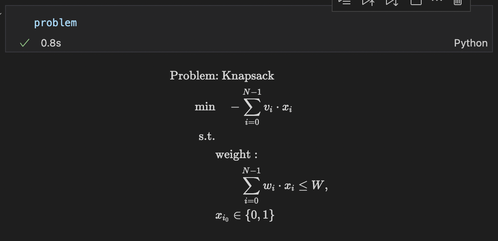

# ナップサック問題

こちらでは、[Lucas, 2014, "Ising formulations of many NP problems"](https://doi.org/10.3389/fphy.2014.00005)の 5.2. Knapsack with Integer Weights を OpenJij と [JijModeling](https://www.ref.documentation.jijzept.com/jijmodeling/)、そして[JijModeling transpiler](https://www.ref.documentation.jijzept.com/jijmodeling-transpiler/) を用いて解く方法をご紹介します。

## 概要: ナップサック問題とは

ナップサック問題は、具体的には以下のような状況で最適解を求める問題です。
最も有名なNP困難な整数計画問題の一つとして知られています。まずは具体例を考えてみましょう。

### 具体例

この問題の具体例として、以下のような物語を考えます。

> ある探検家がある洞窟を探検していました。しばらく洞窟の中を歩いていると、思いがけなく複数の宝物を発見しました。

||宝物A|宝物B|宝物C|宝物D|宝物E|宝物F|
|---|---|---|---|---|---|---|
|値段|$5000|$7000|$2000|$1000|$4000|$3000|
|重さ|800g|1000g|600g|400g|500g|300g|

> しかし探検家の手持ちの荷物の中で宝物を運べるような袋としては、残念ながら小さなナップサックしか持ち合わせていませんでした。
> このナップサックには2kgの荷物しか入れることができません。探検家はこのナップサックに入れる宝物の価値をできるだけ高くしたいのですが、どの荷物を選べば最も効率的に宝物を持って帰ることができるでしょうか。

### 問題の一般化

この問題を一般化するには、ナップサックに入れる荷物$N$個の集合$\{ 0, 1, \dots, i, \dots, N-1\}$があり、各荷物が$i$をインデックスとして持っているものとして考えます。  
ナップサックに入れる各荷物$i$のコストのリスト$\bm{v}$と重さのリスト$\bm{w}$を作ることで、問題を表現することができます。

$$
    \bm{v} = \{v_0, v_1, \dots, v_i, \dots, v_{N-1}\}
$$

$$
    \bm{w} = \{w_0, w_1, \dots, w_i, \dots, w_{N-1}\}
$$

さらに$i$番目の荷物を選んだことを表すバイナリ変数を$x_i$としましょう。この変数は$i$をナップサックに入れるとき$x_i = 1$、入れないとき$x_i = 0$となるような変数です。最後にナップサックの最大容量を$W$とします。  
最大化したいのは、ナップサックに入れる荷物の合計です。よってこれを目的関数として表現しましょう。さらにナップサックの容量制限以下にしなければならない制約を考えると、ナップサック問題は以下のような数式で表現されます。

$$
    \max \ \sum_{i=0}^{N-1} v_i x_i \tag{1}
$$

$$
    \mathrm{s.t.} \quad \sum_{i=0}^{N-1} w_i x_i \leq W \tag{2}
$$

$$
    x_i \in \{0, 1\} \quad (\forall i \in \{0, 1, \dots, N-1\}) \tag{3}
$$

## JijModelingによるモデル構築

### ナップサック問題で用いる変数を定義

式(1), (2), (3)で用いられている変数$\bm{v}, \bm{w}, N, W, x_i, i$を、以下のようにして定義しましょう。

```python
import jijmodeling as jm


# define variables
v = jm.Placeholder('v', dim=1)
N = v.shape[0]
w = jm.Placeholder('w', shape=(N))
W = jm.Placeholder('W')
x = jm.Binary('x', shape=(N))
i = jm.Element('i', (0, N))
```

`v = jm.Placeholder('v', dim=1)`でナップサックに入れる物の価値を表す一次元のリストを宣言し、その具体的な要素数を`N`としています。その`N`を用いて、ナップサックに入れる物の重さを表す一次元のリストを`w = jm.Placeholder('w', shape=(N))`のように定義することで、`v`と`w`が同じ長さであることを保証できます。`W = jm.Placeholder('W')`ではナップサックの容量制限を表す$W$を定義しています。続く`x = jm.Binary('x', shape=(N))`により、`v, w`と同じ長さのバイナリ変数リスト`x`を定義します。最後に`i = jm.Element('i', (0, N))`は$v_i, w_i, x_i$の添字を定義しており、これは$0\leq i < N$の範囲の整数であることを表しています。

### 目的関数の追加

式(1)を目的関数として実装します。

```python
# set problem
problem = jm.Problem('Knapsack')    
# set objective function
obj = - jm.Sum(i, v[i]*x[i])
problem += obj
```

問題を作成し、そこに目的関数を追加しましょう。`Sum(i, 数式)`とすることで、数式部分の総和を添字`i`に対して行うことができます。

### 制約の追加

式(2)の制約を実装しましょう。

```python
# set total weight constraint
const = jm.Sum(i, w[i]*x[i])
problem += jm.Constraint('weight', const<=W)
```

`Constraint(制約名, 制約式)`とすることで、制約式に適当な制約名を付与することができます。  
実際に実装された数式をJupyter Notebookで表示してみましょう。



### インスタンスの作成

先程の冒険家の物語を、インスタンスとして設定しましょう。ただし宝物の価値は$1000で規格化、さらに宝物の重さも100gで規格化された値を用います。

```python
# set a list of values & weights 
inst_v = [5, 7, 2, 1, 4, 3]
inst_w = [8, 10, 6, 4, 5, 3]
# set maximum weight
inst_W = 20
instance_data = {'v': inst_v, 'w': inst_w, 'W': inst_W}    
```

### 未定乗数の設定

このナップサック問題には制約が一つあります。よってその制約の重みを設定する必要があります。
先程の`Constraint`部分で付けた名前と一致させるように、辞書型を用いて設定を行います。

```python
# set multipliers
lam1 = 1.0
multipliers = {'weight': lam1}    
```

### JijModeling transpilerによるPyQUBOへの変換

ここまで行われてきた実装は、全てJijModelingによるものでした。
これを[PyQUBO](https://pyqubo.readthedocs.io/en/latest/)に変換することで、OpenJijはもちろん、他のソルバーを用いた組合せ最適化計算を行うことが可能になります。

```python
from jijmodeling.transpiler.pyqubo import to_pyqubo

# convert to pyqubo
pyq_model, pyq_chache = to_pyqubo(problem, instance_data, {})
qubo, bias = pyq_model.compile().to_qubo(feed_dict=multipliers)
```

JijModelingで作成された`problem`、そして先ほど値を設定した`instance_data`を引数として、`to_pyqubo`によりPyQUBOモデルを作成します。次にそれをコンパイルすることで、OpenJijなどで計算が可能なQUBOモデルにします。

### OpenJijによる最適化計算の実行

今回はOpenJijのシミュレーテッド・アニーリングを用いて、最適化問題を解くことにします。
それには以下のようにします。

```python
# set sampler
sampler = oj.SASampler()
# solve problem
response = sampler.sample_qubo(qubo)
```    

`SASampler`を設定し、そのサンプラーに先程作成したQUBOモデルの`qubo`を入力することで、計算結果が得られます。

### デコードと解の表示

返された計算結果をデコードし、解析を行いやすくします。

```python
# decode solution
result = pyq_chache.decode(response)
```

このようにして得られた結果から、実際にどの宝物をナップサックに入れたのかを見てみましょう。

```python
indices, _, _ = result.record.solution['x'][0]
inst_w = instance_data['w']
sum_w = 0
for i in indices[0]:
    sum_w += inst_w[i]
print('Indices of x = 1: ', indices[0])
print('Value of objective function: ', result.evaluation.objective)
print('Value of constraint term: ', result.evaluation.constraint_violations['weight'])
print('Total weight: ', sum_w)
```

すると以下のような出力を得ます。

```bash
Indices of x = 1:  [0, 3, 4, 5]
Value of objective function:  [-13.0]
Value of constraint term:  [0.0]
Total weight:  20
```

目的関数の値にマイナスをかけたものが、実際にナップサックに入れた宝物の価値の合計です。また`.evaluation.constarint_violations[制約名]`とすることで、その制約がどれだけ満たされていないかを取得することができます。
