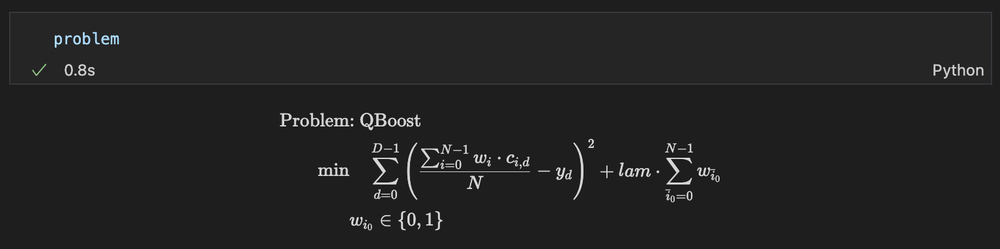

# アニーリングを用いたアンサンブル学習（QBoost)

[QBoost](https://arxiv.org/abs/0811.0416)は量子アニーリングを用いたアンサンブル学習の一つです。
アンサンブル学習は弱い予測器を多数用意し、その予測器の各予測結果を組み合わせることで、最終的に精度の良い予測結果を得る手法です。

## 概要と原理

このQBoostは、入力信号$\bm{x}$がどのような性質を持っているのかを精度良く識別することを目標としたアルゴリズムです。ここでは2つの値$\pm 1$のどちらを入力信号に割り当てるべきかという問題を考えましょう。例として、$\bm{x}$が画像データを表しており、その画像に写っているものが犬か猫かを識別するといったタスクを想像すると良いでしょう。アンサンブル学習では、複数の予測器を利用することで、より良い予測精度を達成すること(ブースティング)を目指します。ここでは、あまり性能の良くない予測器(弱い予測器)をたくさん用意します。性能が良くないという意味は、入力に対して正しい出力をしないことが多いことを意味します。これらの予測器の出力を$c_i (\bm{x}) \in \{ -1, 1\} \ (i=0, 1, \dots, N-1)$とします。いくつかの弱い予測器の出力の和を取ることで、より良い予測ができるというのが基本的な考え方です。これを数式で表すと

$$
C(\bm{x}) 
= \mathrm{sgn} \left( \sum_{i=0}^{N-1} w_i c_i (\bm{x}) \right) 
$$ (1)

となります。ここで$w_i \in \{0, 1\}$で、$i$番目の予測器を使うか使わないかを表します。どの予測器を用いると、できるだけ少ない数の弱い予測器でより良い性能が得られるかを明らかにしましょう。  
このために、教師あり学習を用いて最適な$\{w_i\}$の組を求めることにします。教師データを$(\bm{x}^{(d)}, y^{(d)}) \ (d= 0, 1, \dots, D-1)$を多数用意します($D \gg 1$)。それらをできるだけ忠実に再現するように$\{w_i\}$を調整します。  
この方針をより具体的に表すと、次のハミルトニアンを$\{w_i\}$について最小化することを目指せば良いとわかります。

$$
H(\bm{w}) = \sum_{d=0}^{D-1} \left( \frac{1}{N} \sum_{i=0}^{N-1} w_i c_i (\bm{x}^{(d)}) - y^{(d)}\right)^2 + \lambda \sum_{i=0}^{N-1} w_i 
$$ (2)

このハミルトニアンの最小化を通して、教師データ$y^{(d)}$との差ができるだけ小さくなるようにします。式(1)の右辺をそのまま使うと、符号関数があるために$w_i$の2次形式にならず、イジング模型に帰着することができません。そのため、符号関数の引数$\sum_i w_i c_i$の$1/N$倍と教師データ$y^{(d)}$との差の2乗を最小化する問題にしています。$1/N$の係数は、$\sum_i w_i c_i(\bm{x})$の最大値が$N$であるために$y^{(d)}= \pm 1$との差が大きくなりすぎないのように調整するためのものです。$\lambda (>0)$がかかった項は、あまり多くの$w_i$を1にせず、比較的少数の弱い予測器で効率良く構成するための項(正則化項)を表します。

## JijModelingによるモデル構築

### QBoostで用いる変数を定義

式(2)で用いられている変数を、以下のようにして定義しましょう。

```python
import jijmodeling as jm

# set problem
problem = jm.Problem('QBoost')
# defin variables
c = jm.Placeholder('c', dim=2)
N = c.shape[0].set_latex('N')
D = c.shape[1].set_latex('D')
w = jm.Binary('w', shape=(N))
y = jm.Placeholder('y', shape=(D))
lam = jm.Placeholder('lam')
i = jm.Element('i', (0, N))
d = jm.Element('d', (0, D))
```

`c = jm.Placeholder('c', dim=2)`で式(2)の$c$を定義しています。そのリストの大きさから、弱い予測器の数$N$と教師データ数$D$をそれぞれ`N, D`として定義しています。それらを用いて、最適化に用いるバイナリ変数`w`と教師データのバイナリ値`y`を定義しています。式(2)の$\lambda$を`lam`として定義し、最後に式(2)で用いられている添字`i, d`を定義しています。

### 目的関数の追加

式(2)を実装しましょう。まずは第一項からです。

```python
# set objective function 1: minimize difference
sum_i = jm.Sum(i, w[i]*c[i, d]) / N
problem += jm.Sum(d, (sum_i-y[d])**2)
```

`sum_i`で$\sum_{i=0}^{N-1} w_i c_i / N$を計算しています。  
この実装では第二項も目的関数として実装します。

```python
# set objective function 2: minimize the number of weak classifier
problem += lam * w[:]
```

`w[:]`とすることで、$\sum_i w_i$を簡単に記述することができます。  
ここまでの実装が正しくされているかを確認しましょう。



### インスタンスの作成

実際に実行するタスクなどを設定しましょう。今回は弱い予測器を[scikit-learn](https://scikit-learn.org/stable/)のdecision stump(決定株: 一層の決定木)を用います。また用いるデータはscikit-learnの癌識別データセットを使用します。

```python
import numpy as np
from sklearn import datasets
from sklearn.tree import DecisionTreeClassifier as DTC

def prediction_from_train(N, X_train, y_train, X_test):
    # set the number of ensembles to be taken out for one sample in bootstrap sampling
    sample_train = 40
    # set model
    models = [DTC(splitter="random", max_depth=1) for i in range(N)]
    for model in models:
        # extract randomly
        train_idx = np.random.choice(np.arange(X_train.shape[0]), sample_train)
        # make decision tree with variables
        model.fit(X=X_train[train_idx], y=y_train[train_idx])
    y_pred_list_train = []
    for model in models:
        # execute prediction with model
        y_pred_list_train.append(model.predict(X_train))
    y_pred_list_train = np.asanyarray(y_pred_list_train)
    y_pred_list_test = []
    for model in models:
        # execute with test data
        y_pred_list_test.append(model.predict(X_test))
    y_pred_list_test = np.array(y_pred_list_test)
    return y_pred_list_train, y_pred_list_test

# load data
cancer_data = datasets.load_breast_cancer()
# set the number of train data
num_train = 200
# add noise to feature
noisy_data = np.concatenate((cancer_data.data, np.random.rand(cancer_data.data.shape[0], 30)), axis=1)
# convert (0, 1) label to (-1, 1)
labels = (cancer_data.target-0.5) * 2
# divide dataset to train and test
X_train = noisy_data[:num_train, :]
X_test = noisy_data[num_train:, :]
y_train = labels[:num_train]
y_test = labels[num_train:]
# set the number of classifer
N = 20
# predict from train data using dicision tree classifier
y_pred_list_tarin, y_pred_list_test = prediction_from_train(N, X_train, y_train, X_test)
# set lambda (coefficient of 2nd term)
lam = 3.0
instance_data = {'y': y_train, 'c': y_pred_list_tarin, 'lam': lam, 'y_train': y_train, 'y_test': y_test, 'y_pred_list_test': y_pred_list_test}
```

デモンストレーションのために、ノイズとなる特徴量を加えたものを実際のデータとして用います。`prediction_from_train`関数を用いて弱い予測器の作成と、それらの予測器からの出力$c_i (\bm{x}^{(d)})$を作成しています。ここでは弱い予測器の数を20、教師データ数は200です。最後に式(2)の$\lambda$の値を3.0としています。

### 未定乗数の設定

今回は制約が存在しないため、未定乗数を設定する辞書を空にします。

```python
# set multipliers
multipliers = {}    
```

### JijModeling transpilerによるPyQUBOへの変換

ここまで行われてきた実装は、全てJijModelingによるものでした。
これを[PyQUBO](https://pyqubo.readthedocs.io/en/latest/)に変換することで、OpenJijはもちろん、他のソルバーを用いた組合せ最適化計算を行うことが可能になります。

```python
from jijmodeling.transpiler.pyqubo import to_pyqubo

# convert to pyqubo
pyq_model, pyq_chache = to_pyqubo(problem, instance_data, {})
qubo, bias = pyq_model.compile().to_qubo(feed_dict=multipliers)
```

JijModelingで作成された`problem`、そして先ほど値を設定した`instance_data`を引数として、`to_pyqubo`によりPyQUBOモデルを作成します。次にそれをコンパイルすることで、OpenJijなどで計算が可能なQUBOモデルにします。

### OpenJijによる最適化計算の実行

今回はOpenJijのシミュレーテッド・アニーリングを用いて、最適化問題を解くことにします。
それには以下のようにします。

```python
import openjij as oj

# set sampler
sampler = oj.SASampler()
# solve problem
response = sampler.sample_qubo(qubo, num_reads=5)
```    

`SASampler`を設定し、そのサンプラーに先程作成したQUBOモデルの`qubo`を入力することで、計算結果が得られます。

### デコードと解の表示

返された計算結果をデコードし、解析を行いやすくします。

```python
# decode solution
result = pyq_chache.decode(response)
```

シミュレーテッド・アニーリングにより選ばれた弱い予測器たちを用いて、実際にテストデータの分類精度を見てみましょう。

```python
y_pred_list_train = instance_data['c']
y_train = instance_data['y_train']
y_test = instance_data['y_test']
y_pred_list_test = instance_data['y_pred_list_test']
accs_train_oj = []
accs_test_oj = []
for solution in result.record.solution['w']:
    idx_clf_oj = solution[0][0]
    y_pred_train_oj = np.sign(np.sum(y_pred_list_train[idx_clf_oj, :], axis=0))
    y_pred_test_oj = np.sign(np.sum(y_pred_list_test[idx_clf_oj, :], axis=0))
    acc_train_oj = metrics.accuracy_score(y_true=y_train, y_pred=y_pred_train_oj)
    acc_test_oj = metrics.accuracy_score(y_true=y_test, y_pred=y_pred_test_oj)
    accs_train_oj.append(acc_train_oj)
    accs_test_oj.append(acc_test_oj)    
print('Accuracy of QBoost is {}'.format(max(accs_test_oj)))
```

すると以下のように、テストデータでの分類精度が出力されます。

```bash
Accuracy of QBoost is 0.9159891598915989
```
